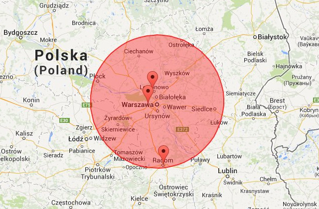
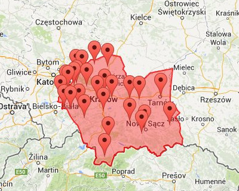

### *Jacek Dermont*

----

### Zadanie 1a

Zaimportowałem bazę za pomocą:
```sh
time mongoimport --db baza --collection train < train.json
```

Wynik, który otrzymałem:
```
Mon Oct 21 09:14:48.402 check 9 6034195
Mon Oct 21 09:14:48.411 imported 6034195 objects

real    9m48.409s
user    4m29.307s
sys     0m22.567s
```

### Zadanie 1b

```js
db.train.count()
6034195
```

### Zadanie 1c

Zamiana stringa na tablicę tagów:
```sh
time python tags.py

real  98m41.818s
user  86m18.332s
sys   3m07.262s
```

Ilość różnych tagów:
```js
db.train.distinct("Tags").length
42048
```

Ilość wszystkich tagów:
```js
db.train.aggregate(
  {
    $project:{"Tags":1}},
    {$unwind: "$Tags"},
    {$group:{"_id":"result",count:{$sum:1}}
  }
)
```
```json
db.train.aggregate({$project:{"Tags":1}},{$unwind: "$Tags"},{$group:{"_id":"result",count:{$sum:1}}})
{
        "result" : [
                {
                        "_id" : "result",
                        "count" : 17409994
                }
        ],
        "ok" : 1
}
```

### Zadanie 1d

Ilość wszystkich słów:
```js
db.slowa.count()
17005207
```

Ilość różnych słów:
```js
db.slowa.distinct("slowo").length
253854
```

Ile procent stanowi 1, 10, 100, 1000 najczęstszych słów?
```js
db.slowa.aggregate(
  [
    {
      $group: {_id:"$slowo",total:{$sum:1}}},
      {$sort:{total:-1}},
      {$limit:1}, // 1, 10, 100, 1000...
      {$group:{_id:"null",total_total:{$sum:"$total"}}},
      {$project:{_id:1,percent:{$divide:["$total_total",{$divide:[db.slowa.count(),100]}]}}
    }
  ]
)
```
```json
{
  "result" : [
    {
      "_id" : "null",
      "percent" : 6.241594118789616
    }
  ],
  "ok" : 1
}
{
  "result" : [
    {
      "_id" : "null",
      "percent" : 24.73339489486955
    }
  ],
  "ok" : 1
}
{
  "result" : [
    {
      "_id" : "null",
      "percent" : 47.03840417820259
    }
  ],
  "ok" : 1
}
{
  "result" : [
    {
      "_id" : "null",
      "percent" : 67.23443001899359
    }
  ],
  "ok" : 1
}
```

#### HDD vs ramdysk
Chciałem sprawdzić, czy mój dysk jest wąskim gardłem. W tym celu czasowo bazę mongodb umieściłem w tmpfs (w RAMie).
Zamontowałem tmpfs:
```
mkdir /tmpfs
mount -t tmpfs -o size=4G,mode=0777 tmpfs /tmpfs
```

Oraz zmieniłem katalog bazy danych w mongodb. Wyedytowałem /etc/mongodb.conf
```
dbpath = /var/lib/mongodb
nojournal = true # wylaczylem journaling bo troche zajmowal
```

Wyniki:
```sh
Baza na HDD:
time mongoimport --db baza --collection slowa < text8.json
real    11m15.649s
user    2m8.957s
sys     0m21.070s

Baza na tmpfs (RAM):
time mongoimport --db baza --collection slowa < text8.json
real    8m11.272s
user    1m40.533s
sys     0m16.473s
```

```sh
Baza na HDD:
time echo 'db.slowa.ensureIndex({"slowo":1})' | mongo baza --quiet
real    3m48.409s
user    0m0.100s
sys     0m0.027s

Baza na tmpfs (RAM):
time echo 'db.slowa.ensureIndex({"slowo":1})' | mongo baza --quiet
real    1m47.142s
user    0m0.130s
sys     0m0.037s
```

Importowanie troszkę szybciej, CPU na 100%. Ustawianie indeksu 2x szybciej, CPU też na 100%. Dysk twardy okazał się wąskim gardłem dla CPU. CPU okazał się wąskim gardłem dla ramdysku.

### Zadanie 1e
Znalazłem koordynaty 262 miast w Polsce, a z wikipedii ściągnąłem liczbę ludności i przerobiłem na format jsona. [miasta.json](../data/jdermont/miasta.json)
```json
{
  "_id" : 218,
  "dlugosc" : 17.27,
  "ludnosc" : 22425,
  "miasto" : "Środa Wielkopolska",
  "szerokosc" : 52.22
}
```

[Skrypt przerabiający na punkty.](../scripts/jdermont/miasta_points.js)
```json
{
  "_id" : 218,
  "dlugosc" : 17.27,
  "ludnosc" : 22425,
  "miasto" : "Środa Wielkopolska",
  "szerokosc" : 52.22,
  "loc" : {
    "type" : "Point",
    "coordinates" : [
      17.27,
      52.22
    ]
  },
}
```

Uwaga: dla 2dsphere mongo (geojson?) przyjmuje jako pierwszy argument szerokość geograficzną (W-E), a drugi jako długość geograficzną (N-S). Np dla współrzędnych 50N 20E, w coordinates będzie [ 20.0, 50.0 ].
```js
db.miasta.ensureIndex({"loc" : "2dsphere"})
```

Przykład 1. 5 miast leżących najbliżej Gdańska (oprócz Gdańska) + formatowanie, żeby niepotrzebnie nie było widać _id i innych rzeczy.
```js
var d
db.miasta.find({"miasto":"Gdańsk"}).forEach(function(input) { d = input.loc } )
db.miasta.find(
  {loc: {$near:{$geometry:d}}},
  {_id:0,miasto:1,loc:1}
).skip(1).limit(5).pretty()
```
```json
{
    "loc" : {
        "type" : "Point",
        "coordinates" : [
            18.559,
            54.439
        ]
    },
    "miasto" : "Sopot"
}
{
    "loc" : {
        "type" : "Point",
        "coordinates" : [
            18.649,
            54.255
        ]
    },
    "miasto" : "Pruszcz Gdański"
}
{
    "loc" : {
        "type" : "Point",
        "coordinates" : [
            18.53,
            54.52
        ]
    },
    "miasto" : "Gdynia"
}
{
    "loc" : {
        "type" : "Point",
        "coordinates" : [
            18.2,
            54.329
        ]
    },
    "miasto" : "Kartuzy"
}
{
    "loc" : {
        "type" : "Point",
        "coordinates" : [
            18.779,
            54.099
        ]
    },
    "miasto" : "Tczew"
}
```

Przykład 2. Miasta z populacją powyżej 50000 w promieniu 100km od Warszawy włącznie.
```js
function km(i) { return i/111.2 } // 1 st. geograficzny = ~111.2 km
db.miasta.find(
  {
    loc: {$geoWithin: {$center: [[21.02,52.259],km(100)]}
  },
  "ludnosc": {$gte:50000}},
  {_id:0,miasto:1,loc:1,ludnosc:1}
).pretty()
```
```json
{
    "loc" : {
        "type" : "Point",
        "coordinates" : [
            21.02,
            52.259
        ]
    },
    "ludnosc" : 1715517,
    "miasto" : "Warszawa",
}
{
    "loc" : {
        "type" : "Point",
        "coordinates" : [
            20.92,
            52.409
        ]
    },
    "ludnosc" : 54109,
    "miasto" : "Legionowo",
}
{
    "loc" : {
        "type" : "Point",
        "coordinates" : [
            21.159,
            51.399
        ]
    },
    "ludnosc" : 219703,
    "miasto" : "Radom",
}
```

[Geojson, obszar województwa małopolskiego.](../data/jdermont/malopolskie.geojson) (z http://global.mapit.dev.mysociety.org)
```sh
mongoimport --collection wojewodztwo < malopolskie.geojson
```
```json
{
  "type": "Polygon",
  "coordinates": [
    [ 
      [ 21.373913, 49.432518 ],
      [ 21.374135, 49.432555 ],
      ...
      [ 21.373913, 49.432518 ]
    ]
}
```

Przykład 3. Miasta w województwie małopolskim, malejąco wg liczby ludności.
```js
var d
var x = db.wojewodztwo.find()
x.forEach(function(input){ d = input })
db.miasta.find({loc: {$geoWithin:{$geometry:d}}}).sort({ludnosc:-1})
```
```json
{
    "_id" : 88,
    "dlugosc" : 19.959,
    "loc" : {
      "type" : "Point",
      "coordinates" : [
        19.959,
        50.06
      ]
    },
    "ludnosc" : 758463,
    "miasto" : "Kraków",
    "szerokosc" : 50.06
}
{
    "_id" : 223,
    "dlugosc" : 20.99,
    "loc" : {
      "type" : "Point",
      "coordinates" : [
        20.99,
        50.009
      ]
    },
    "ludnosc" : 112952,
    "miasto" : "Tarnów",
    "szerokosc" : 50.009
}
{
    "_id" : 141,
    "dlugosc" : 20.699,
    "loc" : {
      "type" : "Point",
      "coordinates" : [
        20.699,
        49.63
      ]
    },
    "ludnosc" : 84129,
    "miasto" : "Nowy Sącz",
    "szerokosc" : 49.63
}
...
{
    "_id" : 244,
    "dlugosc" : 19.77,
    "loc" : {
      "type" : "Point",
      "coordinates" : [
        19.77,
        50.39
      ]
    },
    "ludnosc" : 8926,
    "miasto" : "Wolbrom",
    "szerokosc" : 50.39
}
```

Przykład 4. Przykład użycia $geoIntersects. W tym przypadku nie różni się od $geoWithin, ponieważ punkty i tak 'przecinają' (zawierają się w) wielokąt (województwo).
```js
db.miasta.find({loc: {$geoWithin:{$geometry:d}}}).count()
28
db.miasta.find({loc: {$geoIntersects:{$geometry:d}}}).count()
28
```

Przykład 5. Szukamy miast w woj. małopolskim w promieniu 25km od Krakowa.
```js
db.miasta.find({
  loc:{$within:{$geometry:d}},
  loc:{$within:
  {
    $center:[[19.959,50.06],km(25)]
  },
  {_id:0,miasto:1,loc:1}
}}).pretty()
```
```json
{
    "loc" : {
        "type" : "Point",
        "coordinates" : [
            19.959,
            50.06
        ]
    },
    "miasto" : "Kraków",
}
{
    "loc" : {
        "type" : "Point",
        "coordinates" : [
            20.09,
            49.99
        ]
    },
    "miasto" : "Wieliczka",
}
{
    "loc" : {
        "type" : "Point",
        "coordinates" : [
            19.939,
            49.839
        ]
    },
    "miasto" : "Myślenice",
}
{
    "loc" : {
        "type" : "Point",
        "coordinates" : [
            19.83,
            49.979
        ]
    },
    "miasto" : "Skawina",
}
```

Przyład 6. Użycie LineString, czy linia jest w polygonie (lub ją przecina)?
```js
var line1 = {type : "LineString" , coordinates : [[19.960, 51.06] , [41 , 6]]}
db.wojewodztwa.find({loc:{$geoIntersects:{$geometry:line1}}}).count()
1
```

#### Obrazki (dzięki google maps):

Przykład 2.



Przykład 3.


