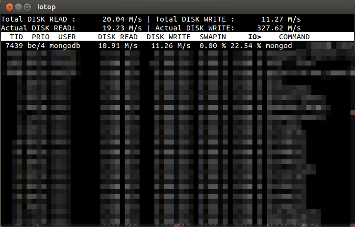
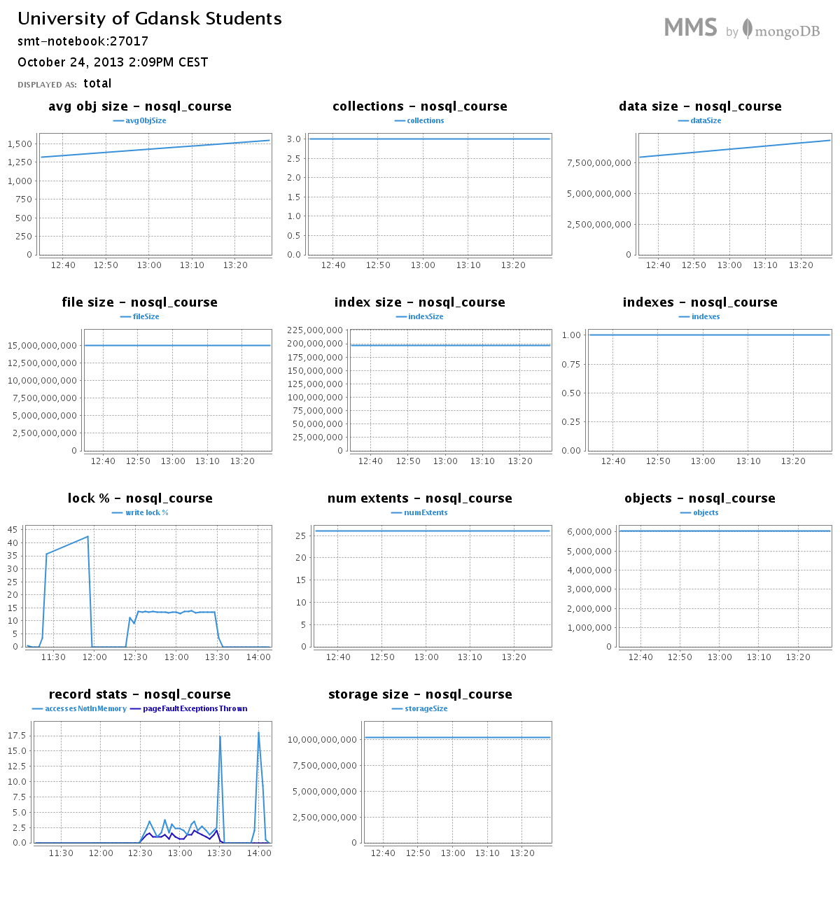
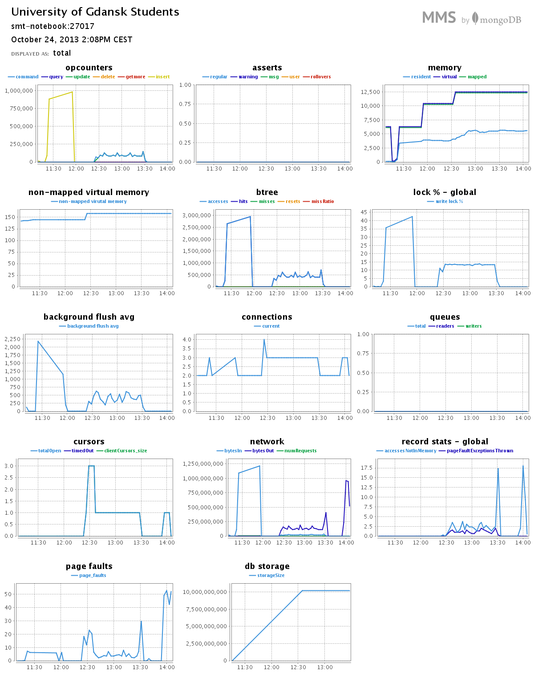
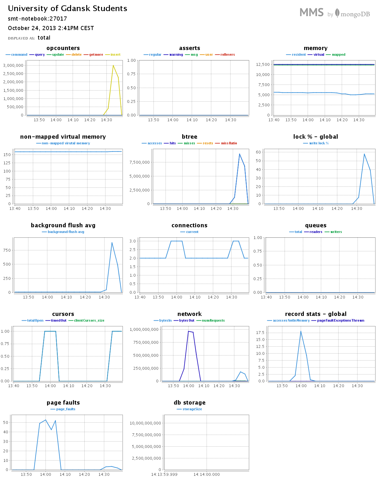
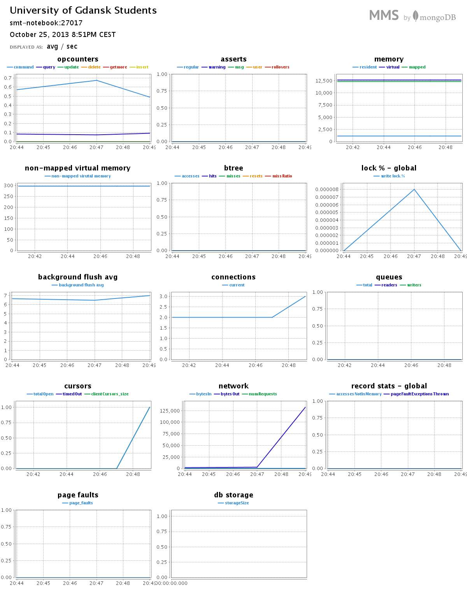

## MongoDB version

```bash
MongoDB shell version: 2.4.7
```

## TL;DR

* 1a

  ```bash
  $ time bash prepare_data.bash Train.csv prepared_train.csv
  ```

* 1b

  ```bash
  $ time bash import_csv.bash nosql_course trains prepared_train.csv
  ```

* 1c

  ```bash
  $ time ruby split_tags.rb nosql_course trains

  # Print number of occuration for each tag
  $ time ruby count_tags.rb nosql_course trains

  # Print number of different tags
  MongoDB Shell > db.train.distinct("Tags").length
  ```

* 1d

  ```bash
  # Early EDA:

  wget http://mattmahoney.net/dc/text8.zip -O text8.gz
  tr --delete '[:alnum:][:blank:]' < text8 > deleted.txt
  ls -l deleted.txt
  # should be: -rw-rw-r--. 1 wbzyl wbzyl 0 10-16 12:58 deleted.txt
  rm deleted.txt
  wc text8
  # should be: 0         17005207 100000000 text8
  tr --squeeze-repeats '[:blank:]' '\n' < text8 > text8.txt
  wc text8.txt
  # should be: 17005207  17005207 100000000 text8.txt  # powtórzone 17005207 -> OK
  ```

  ```bash
  # Preparing for mongoimport

  # remove first blank line, add word header and save as csv
  sed 1d text8.txt | sed '1s/^/word\n/' > text8.csv
  ```

  ```bash
  # Import

  $ time bash import_csv.bash nosql_course text8 text8.csv
  ```

  ```bash
  # Count words

  $ time ruby count_words.rb nosql_course text8
  ```

  ```bash
  # Count percents...

  $ time ruby count_words_percents.rb nosql_course text8
  ```

* 1e

  ```bash
  # Get db

  wget http://geonames.usgs.gov/docs/stategaz/AllStates_20131020.zip
  ```

  ```bash
  # Early EDA

  $ time bash prepare_geo_data.bash AllStates data.csv
  ```

  ```bash
  # Import

  $ time bash import_csv.bash nosql_course allstates AllStates/data.csv
  ```

  ```bash
  # Making points from ltg/lng fields

  $ time ruby make_geo_points.bash nosql_course allstates
  ```

## Starting separated MongoDB cluster

```bash
mongod --fork --logpath path_to_logs --smallfiles --nojournal --dbpath path_to_cluster
```

# Train

## Preparing data

```bash
~/repos/aggregations-2/scripts/mmalecki (maciej-malecki)
 $ time bash prepare_data.bash ../../data/mmalecki/tmp/Train.csv ../../data/mmalecki/tmp/prepared_train.csv

 real  2m2.507s
 user  0m32.282s
 sys   0m22.363s
```

## Importing prepared data from csv to mongodb

```bash
~/repos/aggregations-2/scripts/mmalecki (maciej-malecki)
 $ time bash import_csv.bash nosql_course trains ../../data/mmalecki/tmp/prepared_train.csv 

 # check link below for output from importing

 Thu Oct 24 11:54:52.520 check 9 6034196
 Thu Oct 24 11:54:52.520 imported 6034195 objects

 real  4m48.196s
 user  3m8.919s
 sys   0m36.793s
```

[check importing output](importing_output.txt)

#### Resources while importing:

##### Disk io



##### Processor and memory


## Converting tags from string to array

```bash
~/repos/aggregations-2/scripts/mmalecki (maciej-malecki) 
 $ time ruby split_tags.rb nosql_course trains
 db: nosql_course, collection: trains

 [...]

 real  63m21.708s
 user  38m58.566s
 sys   5m19.826s
```

Why so slow? because `split_tags.rb` is not multi-thread script ;).
Ofcourse it is possible to re-write it and use more threads.

## Counting tags

### Show number of occuration of each tag

```bash
~/repos/aggregations-2/scripts/mmalecki (maciej-malecki) 
 $ time ruby count_tags.rb nosql_course trains

# check link below for tags

 real  7m8.077s
 user  4m28.623s
 sys   0m26.720s
```

[check number of occurration of the each tag](../../data/mmalecki/tags.csv)

### Show number of different tags in MongoDB Shell

```bash
~/repos/aggregations-2/scripts/mmalecki (maciej-malecki)
 $ mongo

 MongoDB shell version: 2.4.7
 connecting to: nosql_course
 > db.train.distinct("Tags").length
 42048
```

## MMS Monitoring

#### 1a - 1c




# Text8

## Early EDA:

```bash
~/repos/aggregations-2/scripts/mmalecki (maciej-malecki)
 $ wget http://mattmahoney.net/dc/text8.zip -O text8.gz

~/repos/aggregations-2/scripts/mmalecki (maciej-malecki)
 $ tr --delete '[:alnum:][:blank:]' < text8 > deleted.txt

~/repos/aggregations-2/scripts/mmalecki (maciej-malecki)
 $ ls -l deleted.txt
 # should be: -rw-rw-r--. 1 wbzyl wbzyl 0 10-16 12:58 deleted.txt

~/repos/aggregations-2/scripts/mmalecki (maciej-malecki)
 $ rm deleted.txt

~/repos/aggregations-2/scripts/mmalecki (maciej-malecki)
 $ wc text8
 # should be: 0         17005207 100000000 text8

~/repos/aggregations-2/scripts/mmalecki (maciej-malecki)
 $ tr --squeeze-repeats '[:blank:]' '\n' < text8 > text8.txt

~/repos/aggregations-2/scripts/mmalecki (maciej-malecki)
 $ wc text8.txt
 # should be: 17005207  17005207 100000000 text8.txt  # powtórzone 17005207 -> OK
```

## Preparing for mongoimport

```bash
~/repos/aggregations-2/scripts/mmalecki (maciej-malecki)
 $ sed 1d text8.txt | sed '1s/^/word\n/' > text8.csv
 # remove first blank line, add word header and save as csv
```

## Import to MongoDB

```bash
~/repos/aggregations-2/scripts/mmalecki (maciej-malecki)
 $ time bash import_csv.bash nosql_course text8 text8.csv

 real 5m9.878s
 user 0m47.601s
 sys  0m9.228s
```

## Counting words

```bash
~/repos/aggregations-2/scripts/mmalecki (maciej-malecki)
 $ time ruby count_words.rb nosql_course text8

 # check link below for numbers

 real  0m25.927s
 user  0m1.419s
 sys   0m0.112s
```

[check number of occurration of each word](../../data/mmalecki/text8.csv)

## Counting "percents of"

```bash
~/repos/aggregations-2/scripts/mmalecki (maciej-malecki)
 $ time ruby count_words_percents.rb nosql_course text8

 # check link below for numbers

 real  0m16.998s
 user  0m0.937s
 sys   0m0.072s
```

[check number of occurration of "tops"](../../data/mmalecki/text8_percents.csv)

## MMS Monitoring

#### 1d

##### Importing



##### Counting...



# Geo...

## Download and decompress the database

It is small database.... it is so hard to find bigdata geo db :/

```bash
wget http://geonames.usgs.gov/docs/stategaz/AllStates_20131020.zip
unzip AllStates_20131020
```

## Early EDA

```bash
~/repos/aggregations-2/scripts/mmalecki (maciej-malecki)
 $ time bash prepare_geo_data.bash ../../mmalecki/data/AllStates/ data.csv

 real  0m13.503s
 user  0m17.433s
 sys   0m1.875s
```

## Import to MongoDB

```bash
~/repos/aggregations-2/scripts/mmalecki (maciej-malecki)
 $ time bash import_csv.bash nosql_course allstates ../../data/mmalecki/tmp/AllStates/data.csv

 # check link below for output from importing

 Sun Oct 27 00:11:13.198 check 9 6793101
 Sun Oct 27 00:11:13.275 imported 6793100 objects

 real  3m7.304s
 user  1m41.477s
 sys   0m6.826s
```

## Creating mongo points from lat/lng fields

```bash
~/repos/aggregations-2/scripts/mmalecki (maciej-malecki)
 $ time ruby make_geo_points.bash nosql_course allstates

 real  98m20.389s
 user  73m31.141s
 sys   9m56.322s
```

Done in parallel in 2-4 processes at the same time.
Number of processes at the same time depend on heat
(scale down and up manually).
Check the screens from MMS for visualization.

## MMS Monitoring

### Importing


### Making points


