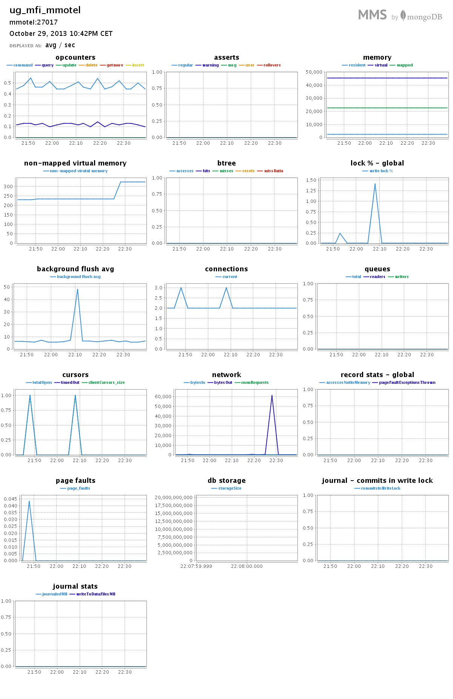
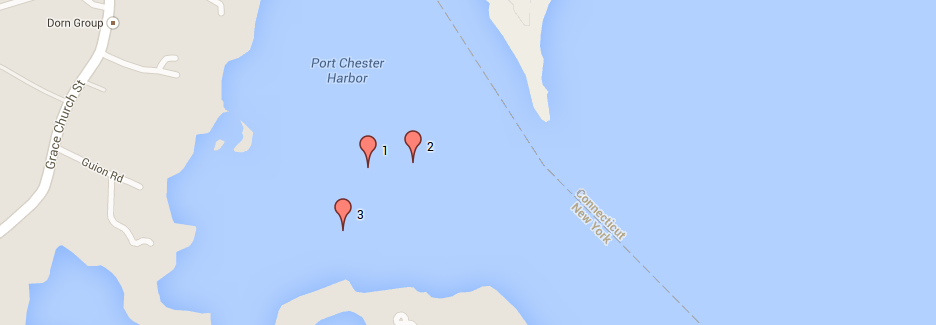

###Mateusz Motel

***

#Zadania 1a i 1b

##Poprawienie pliku

Plik `Train.csv` zawiera znaki nowej linii (`\n`) w polach . Należy to naprawić wykonując następujacą transformację:

```sh
cat Train.csv | tr "\n" " " | tr "\r" "\n" | head -n 6034196 > Train_prepared.csv
```

Plik powinien zawierać `6 034 196` linii. Jak można sprawdzić wykonująć:

```sh
wc -l Train_prepared.csv
6043196 Train_prepared.csv
```

Jest ok. Gdy mamy już poprawny plik `.csv` robimy import do bazy.

##Import

Podczas importu mierzymy czas za pomocą polecenia `time` poprzedzając im właściwe polecenie `mongoimport` ze wszystkimi parametrami.

```sh
time mongoimport -d train -c train --type csv --headerline --file Train_prepared.csv
```

####Wynik

```sh
connected to: 127.0.0.1
Mon Oct 28 18:29:37.015 		Progress: 41930908/7253917399	0%
...
Mon Oct 28 18:38:44.773 		Progress: 7252389096/7253917399	99%
Mon Oct 28 18:38:44.773 			6032900	10968/second
Mon Oct 28 18:38:45.110 check 9 6034196
Mon Oct 28 18:38:45.338 imported 6034195 objects
```

####Czasy

```sh
real	9m11.278s
user	2m53.240s
sys 	0m13.764s
```

W ciągu `9m11.278s` do bazy zaimportowało się `6 034 195` obiektów. Co średnio daje `~16 264` insertów do bazy na sekundę.

####Sprawdzenie

```js
mongo
MongoDB shell version: 2.4.6
connecting to: test
> use train
switched to db train
> db.train.count()
6034195
```

###Wyniki z MongoDB Management Service


***

#Zadanie 1c

##Zamiana ciągu napisów na tablicę napisów

Sprawdzamy jakiego typu jest pole `Tags` każdego elemenu kolekcji `train`. Następnie używamy metodę `split()` aby rozdzielić ciag napisów do tablicy lub dodajemy zawartość innego typu (np. liczbowego) do tablicy.

```js
if(item.Tags.constructor !== Array){  
  var tagsSplited = []; //tablica na rozdzielone tagi

  if(item.Tags.constructor === String){
    var tagsSplited = item.Tags.split(" ");
  } else {
    tagsSplited.push(item.Tags);
  }
}
```

##Rozwiązanie `Node.JS`

Do rozwiązania zadania użyłem skryptu `JavaScript` uruchamianego na serwerze [`Node.JS`](http://nodejs.org/) w wersji `0.10.21`, który korzysta ze sterownika [`The Node.JS MongoDB Driver`](http://mongodb.github.io/node-mongodb-native/) w wersji `1.3.19`.

Kod skryptu: [convert-tags.js](../scripts/mmotel/1c/convert-tags.js).

####Instalacja

Do uruchowienia skryptu potrzebujemy `Node.JS` w najnowszej wersji. Instrukcja instalacji pod `Linuxem`: [link](https://github.com/joyent/node/wiki/Installing-Node.js-via-package-manager).

Instalujemy pakiety (w tym wypadku sam sterownik do mongo) zawarte w pliku [`package.json`](../scripts/mmotel/1c/package.json):

```sh
npm install
```

####Uruchomienie

```sh
time node convert-tags.js
```

####Wyniki

```sh
MongoDB Połączono!
...
obiektów: 6030000 aktualizacji: 6030000 tagów: 17397682 różnych tagów: 42047
Wykonano 6030000 aktualizacji.
Wykonano 6034195 aktualizacji.
Update-y zakończone.
MongoDB Rozłączone!
ilość obiektów: 6034195
ilość updateów: 6034195
   ilość tagów: 17409994
 różnych tagów: 42048
```

####Sprawdzenie

Element po wykonaniu aktualizacji:

```js
> db.train2.findOne()
```

```json
{
  "_id" : ObjectId("527236d49bf8f201b1bd461e"),
  "Id" : 1,
  "Title" : "How to check if an uploaded file is an image without mime type?",
  "Body" : "<p>I'd like to check if an uploaded file is an image file (e.g png, jpg, jpeg, gif, bmp)
   or another file. The problem is that I'm using Uploadify to upload the files, which changes the 
   mime type and gives a 'text/octal' or something as the mime type, no matter which file type you 
   upload.</p>  <p>Is there a way to check if the uploaded file is an image apart from checking the 
   file extension using PHP?</p> ",
  "Tags" : [
    "php",
    "image-processing",
    "file-upload",
    "upload",
    "mime-types"
  ]
}

```

####Czasy

```sh
real  13m1.030s
user  5m31.832s
sys   0m10.816s
```

W ciągu `13m1.030s` wykonano `6 034 195` aktualizacji. Co średnio daje `~7 726` aktualizacji na sekundę.

####Wyniki z MongoDB Management Service

`**` Czerwona linia oznacza wykonanie restartu bazy danych.


##Rozwiązanie `powłoka Mongo`

Do rozwiązania zadania użyłem również skryptu `JavaScript` uruchamianego na powłoce `Mongo`. 

Kod skryptu: [mongo-convert-tags.js](../scripts/mmotel/1c/mongo-convert-tags.js).

####Uruchomienie

```sh
time mongo train mongo-convert-tags.js 
```

####Wyniki

```sh
MongoDB shell version: 2.4.7
connecting to: train
     obiektów: 6034195
 aktualizacji: 6034195
        tagów: 17409994
różnych tagów: 42048
```

####Sprawdzenie

Element po wykonaniu aktualizacji:

```json
{
  "_id" : ObjectId("526e9eea0d0994b3ea766bc5"),
  "Id" : 1,
  "Title" : "How to check if an uploaded file is an image without mime type?",
  "Body" : "<p>I'd like to check if an uploaded file is an image file (e.g png, jpg, jpeg, gif, bmp) 
  or another file. The   problem is that I'm using Uploadify to upload the files, which changes the 
  mime type and gives a 'text/octal' or    something as the mime type, no matter which file type you 
  upload.</p>  <p>Is there a way to check if the uploaded file    is an image apart from checking the 
  file extension using PHP?</p> ",
  "Tags" : [
    "php",
    "image-processing",
    "file-upload",
    "upload",
    "mime-types"
  ]
}
```
####Czasy

```sh
real  18m46.243s
user  11m35.016s
sys   0m14.732s
```

W ciągu `18m46.243s` wykonano `6 034 195` aktualizacji. Co średnio daje `~5 358` aktualizacji na sekundę.


####Wyniki z MongoDB Management Service


***

#Zadanie 1d

Do rozwiązania zadania użyłem skryptu `JavaScript` uruchamianego na powłoce `Mongo`.

##Import

Po przygotowaniu pliku `text8.txt` zgodnie ze `wskazówką` ([patrz treść zadania](http://wbzyl.inf.ug.edu.pl/nosql/zadania)), importujemy słowa do bazy danych jednocześnie mierząc czas:

```sh
time mongoimport -d text -c text --type csv --fields 'word' --file text8.txt 
```

###Wynik

```sh
connected to: 127.0.0.1
Tue Oct 29 20:34:16.304     Progress: 557689/100000000  0%
Tue Oct 29 20:34:16.304       92600 30866/second
...
Tue Oct 29 20:42:47.037     Progress: 99670107/100000000  99%
Tue Oct 29 20:42:47.037       16950000  32976/second
Tue Oct 29 20:42:48.382 check 9 17005207
Tue Oct 29 20:42:49.272 imported 17005207 objects
```

###Czasy

```sh
real  8m36.433s
user  0m56.236s
sys   0m11.976s
```

W ciągu `8m16.833s` zaimportowano `17 005 207` słów. Co średnio daje `~32 955` insertów do bazy na sekundę.

###Sprawdzenie

```js
mongo
MongoDB shell version: 2.4.7
connecting to: test
> use text
switched to db text
> db.text.count()
17005207
```

###Wyniki z MongoDB Management Service


##Zliczanie słów

####Agregacja

Do zliczania słów użyjemy prostej `agregacji`:

```js
coll.aggregate(
  { $group: {_id: "$word", count: {$sum: 1}} },
  { $sort: {count: -1} },
  { $limit: 1 } //lub 10, 100, 1000
)
```

Ustawiając lub wykomentowując `$limit` ustalamy ilość elementów, które otrzymamy w wyniku agregacji.

###Różnych słów

```sh
MongoDB shell version: 2.4.7
connecting to: text
 słów: 253854
ilość: 17005207
część: 100%
```

####Czasy:

```sh
real  0m18.030s
user  0m1.340s
sys   0m0.124s
```

###1 słowo

```sh
MongoDB shell version: 2.4.7
connecting to: text
```

```json
{ "result" : [ { "_id" : "the", "count" : 1061396 } ], "ok" : 1 }
```

```sh
 słów: 1
ilość: 1061396
część: 6.241594118789616%
```

Czasy:

```sh
real  0m15.979s
user  0m0.048s
sys   0m0.012s
```

###10 słów

```sh
MongoDB shell version: 2.4.7
connecting to: text
```

```json
{
  "result" : [
    { "_id" : "the",  "count" : 1061396 },
    { "_id" : "of",   "count" : 593677  },
    { "_id" : "and",  "count" : 416629  },
    { "_id" : "one",  "count" : 411764  },
    { "_id" : "in",   "count" : 372201  },
    { "_id" : "a",    "count" : 325873  },
    { "_id" : "to",   "count" : 316376  },
    { "_id" : "zero", "count" : 264975  },
    { "_id" : "nine", "count" : 250430  },
    { "_id" : "two",  "count" : 192644  }
  ],
  "ok" : 1
}
```

```sh
 słów: 10
ilość: 4205965
część: 24.733394894869555%
```

####Czasy:

```sh
real  0m16.088s
user  0m0.056s
sys   0m0.008s
```
###100 słów

```sh
MongoDB shell version: 2.4.7
connecting to: text
```

```json
{
  "result" : [
    { "_id" : "the",     "count" : 1061396 },
    { "_id" : "of",      "count" : 593677  },
    { "_id" : "and",     "count" : 416629  },
    { "_id" : "one",     "count" : 411764  },
    { "_id" : "in",      "count" : 372201  },
    //...
    { "_id" : "history", "count" : 12623   },
    { "_id" : "will",    "count" : 12560   },
    { "_id" : "up",      "count" : 12445   },
    { "_id" : "while",   "count" : 12363   },
    { "_id" : "where",   "count" : 12347   }
  ],
  "ok" : 1
}
```

Pełny wynik agregacji: [tutaj](./mmotel/1d-top-100.md).


```sh
 słów: 100
ilość: 7998978
część: 47.03840417820259%
```

####Czasy:

```sh
real  0m16.055s
user  0m0.056s
sys   0m0.016s
```

###1000 słów

```sh
MongoDB shell version: 2.4.7
connecting to: text
```

```json
{
  "result" : [
    { "_id" : "the",     "count" : 1061396 },
    { "_id" : "of",      "count" : 593677  },
    { "_id" : "and",     "count" : 416629  },
    { "_id" : "one",     "count" : 411764  },
    { "_id" : "in",      "count" : 372201  },
    //...
    { "_id" : "child",   "count" : 1789    },
    { "_id" : "element", "count" : 1787    },
    { "_id" : "appears", "count" : 1786    },
    { "_id" : "takes",   "count" : 1783    },
    { "_id" : "fall",    "count" : 1783    }
  ],
  "ok" : 1
}
```

Pełny wynik agregacji: [tutaj](./mmotel/1d-top-1000.md).

```sh
 słów: 1000
ilość: 11433354
część: 67.23443001899359%
```

####Czasy:

```sh
real  0m16.109s
user  0m0.112s
sys   0m0.008s
```

##Wyniki z MongoDB Management Service



***

#Zadanie 1e

##Dane

Do rozwiązania zadania użyłem danych ze strony [`U.S. Geological Survey`](http://www.usgs.gov/) z działu [`United States Board on Geographic Names`](http://geonames.usgs.gov/) pt. [`Domestic and Antarctic Names`](http://geonames.usgs.gov/domestic/download_data.htm) dla stanu `Nowy Jork`.

Źródło danych: [link](http://geonames.usgs.gov/docs/stategaz/NY_Features_20131020.zip).

####Format pliku

Plik zawiera wartości oddzielone znakiem `|`. Linia z nagłówkami:

```
FEATURE_ID|FEATURE_NAME|FEATURE_CLASS|STATE_ALPHA|STATE_NUMERIC|COUNTY_NAME|COUNTY_NUMERIC|PRIMARY_LAT_DMS|
PRIM_LONG_
DMS|PRIM_LAT_DEC|PRIM_LONG_DEC|SOURCE_LAT_DMS|SOURCE_LONG_DMS|SOURCE_LAT_DEC|SOURCE_LONG_DEC|ELEV_IN_M|ELEV_IN_FT|MAP_
NAME|DATE_CREATED|DATE_EDITED
``` 

Przykładowa linia z danymi:

```
205110|Appalachian National Scenic Trail|Trail|PA|42|Perry|099|401920N|0770439W|40.3221113|-77.0775473|||||200|656|
Wertzville|09/12/1979|01/03/2010
```

##EDA

###Przygotowanie danych

####Poprawienie pliku

Przerabiamy plik do formatu `.csv`. Aby to zrobić musimy jedynie zamienić `|` na `,`.

```sh
cat NY_Features_20131020.txt | tr "|" "," > NY_Prepared.txt
```

####Import 

```sh
time mongoimport -d geony -c ny --type csv --headerline --file NY_Prepared.txt
```

####Wynik

```sh
connected to: 127.0.0.1
Wed Oct 30 18:11:43.003 		Progress: 5484351/10467976	52%
Wed Oct 30 18:11:43.003 			40900	13633/second
Wed Oct 30 18:11:44.412 check 9 77132
Wed Oct 30 18:11:44.538 imported 77131 objects
```

####Czasy

```sh
real	0m4.324s
user	0m1.392s
sys	0m0.144s
```

###Robimy geoJSONy

Do przygotowania obiektów `geoJSON` użyjemy prostego skryptu powłoki `Mongo`, który z pól: `FEATURE_ID` ,`FEATURE_NAME` ,`PRIM_LONG_DEC` ,`PRIM_LAT_DEC` utworzy obiekty o takiej strukturze:

```json
{
	"id": FEATURE_ID,
	"name": FEATURE_NAME,
	"loc": { "type":"Point", "coordinates": [ PRIM_LONG_DEC , PRIM_LAT_DEC ] }
}
```

`**` Skrypt usuwa niepoprawne obiekty geoJSON z kolekcji `ny`. Jest ich `16`. Odrzucone obiekty można zobaczyć [tutaj](./mmotel/1e-deleted-geo-jsons.md).

Kod skryptu: [make-geo-jsons.js](../scripts/mmotel/1e/make-geo-jsons.js).

####Uruchamiamy skrypt:

```sh
time mongo geony make-geo-jsons.js 
```

####Czasy

```sh
real	0m7.311s
user	0m6.484s
sys	0m0.772s
```

####Dodajemy indeks:

```js
db.geony.ensureIndex({"loc" : "2dsphere"});
```

##Zapytania

###$near

Wybrany punkt:

```json
{ 
	"_id" : ObjectId("527173ea5ac806a1e7c896ca"), 
	"id" : 209943, 
	"name" : "Port Chester Harbor", 
	"loc" : { 
		"type" : "Point", 
		"coordinates" : [ -73.6605406,  40.9844661 ] 
	} 
}
```

Port Chester Harbor w Google Maps: [link](http://goo.gl/maps/V2i7z).


```js
var punkt = { 
	"type" : "Point", 
	"coordinates" : [ -73.6605406,  40.9844661 ] 
};

db.geony.find({ loc: {$near: {$geometry: punkt}, $maxDistance: 200} }).toArray()
```

####Wynik

```json
[
	{
		"_id" : ObjectId("527173ea5ac806a1e7c896ca"),
		"id" : 209943,
		"name" : "Port Chester Harbor",
		"loc" : {
			"type" : "Point",
			"coordinates" : [ -73.6605406, 40.9844661 ]
		}
	},
	{
		"_id" : ObjectId("527173ed5ac806a1e7c91ee6"),
		"id" : 977443,
		"name" : "Manursing Island Reef",
		"loc" : {
			"type" : "Point",
			"coordinates" : [ -73.6595721, 40.9845422 ]
		}
	},
	{
		"_id" : ObjectId("527173ed5ac806a1e7c91eb4"),
		"id" : 977393,
		"name" : "Port Chester Harbor",
		"loc" : {
			"type" : "Point",
			"coordinates" : [ -73.6610683, 40.9834385 ]
		}
	}
]
```

####Wynik na Google Maps

`1` - Port Chester Harbor (wybrany punkt), `2` - Manursing Island Reef, `3` - Port Chester Harbor ("id" : 977393).



##Wyniki z MongoDB Management Service


##Ciąg dalszy niebawem...